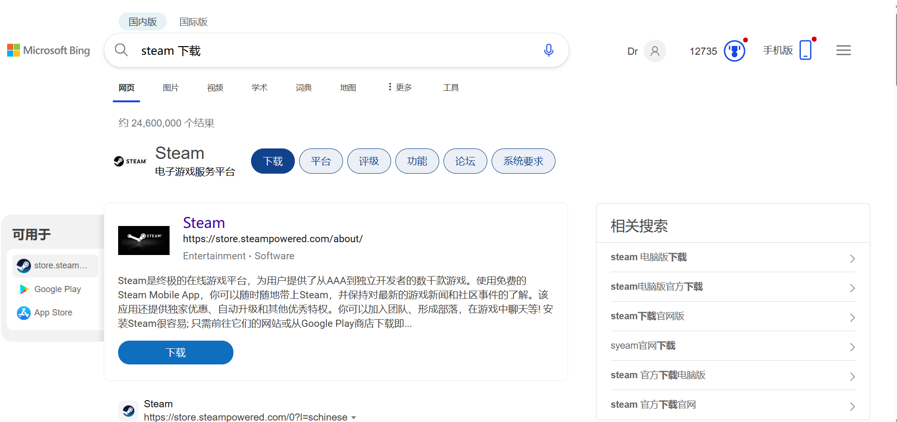

# Drive Your Computer IV

作者：DrBit-64

## 网络安全
写在前面，虽然这部分的标题叫做“网络安全”，但不会介绍任何关于网络的技术层面的协议或是加密方式实现原理，而是主要介绍如何更好地使用现在这个并不太平的互联网，情放心食用。

### 一个作为开始的段子
你已经死了，这里是地狱！

因为你生前总是对着一堆没品笑话哈哈大笑，所以我们决定对你实施最严厉的酷刑！

——观看大学生操作电脑！

看吧！他在使用Excel，但是他不会用任何一个快捷键！哦天哪他的Ctrl键甚至是全新的……他连自动填充和方向键都不用！从1到100都是手打的！

他输入中文的时候只用两根食指！每输入完一个词，他都用鼠标去点候选词！他一分钟打20个字！

他想要居中标题，在标题前面打了一连串的空格！直到标题看起来在中间的位置了！

他直接在百度上搜“爱奇艺下载”了！他点进了华军软件园了！他点了那个最大的“高速下载”！他直接运行了p2p下载器！他没有取消任何一个勾选的捆绑程序，直接点了下一步！他的桌面上多了4个，不，5个，不，6个图标！

他的表格做好了，噢他直接保存到wps云端了！他不知道如何把这份表格发给他的上司！他点了分享按钮，给他的上司发了一个金山文档链接！这份表格在云端查看的时候彻底乱码了！

他正在下载破解版游戏，他得到了一个压缩包！噢他没有解压缩，直接在压缩软件里点开了game.exe！游戏报错了！

他安装了一个游戏！他把game.exe直接剪切到了桌面！点开之后又报错了！

他希望把室友电脑里的游戏拷贝到自己电脑里！他把桌面上的快捷方式直接拖到了自己的U盘里！插回自己电脑运行的时候又报错了！

他打开文件的方式是鼠标左键疯狂连点！他至少点了10次！天哪现在桌面上的弹窗都堆不下了！

他把"Doc1.docx"直接重命名成了"实验报告"！他连后缀名都删干净了！现在他再也找不到打开这份文档的方法了！

他在微信上收到了一个文件，他需要把这个文件用邮箱发出去。噢他完全不知道该怎么操作！他在收件人这一栏输入了上司的手机号！他完全不知道如何添加附件！他也完全不知道微信文件保存到哪里了！他对着微信消息按右键复制，然后把文件名粘贴到了正文栏！

他需要下载一个腾讯视频！他在视频网页点击了“下载”，浏览器开始下载腾讯视频客户端了！他开始安装了！他在客户端里下载了一个.qlv格式的文件！他直接把这个文件发给别人了！

感受痛苦吧！你甚至没法教会他们！

### 小心搜索引擎中的陷阱
上面段子里主角一样的人物终究只占少数，不过有关搜索引擎使用带来的问题却十分常见，而事故高发地之一就是steam的下载。

   

很遗憾，这张图内所有看起来像是steam的搜索结果全部导向冒充steam的第三方网站。

_一个小互动任务：试着找到这两个搜索条目中的“广告”字样。_

很显然误导性如此之强的广告放在首位不是一个好的搜索引擎应该有的行为，不过我们还是可以通过自己的一些努力去防范中招。

首先下载最好认准官方途径，除非对自己有着足够的自信否则不建议尝试 _xx软件园_ 之类的网站。steam成为重灾区的一个主要原因就是它的官网域名`https://store.steampowered.com/`并不直观，并且由于其本身的特殊性导致中国境内对其的连接并不稳定，还因为伪造steam有利可图而导致大量仿照steam的网站被制作出来坑害新人。搜索`steam游戏管家`等关键词可以详细吃瓜这类坑害新人的事件。相比之下国内软件的官网一般不至于在搜索引擎内直接“查无此人”，在搜索引擎中躲开广告条目就可以找到官网。

搜索引擎的选择同样很重要，而上图所示的360搜索很明显不是一个好的选择。一般来说，`google`在准确度与效率上更胜一筹，不过需要科学上网。`bing`与`百度`大部分情况下也都可以满足使用需求，而其他的搜索引擎就不作推荐了。

`edge`,`chrome`,`firefox`这些浏览器都支持安装扩展（插件），可以在浏览器上安装广告拦截器相关插件，能够帮助处理掉很多烦人的广告，当然也包括上面那张图中那些带有“广告”字样的搜索结果条目。插件的安装方法可以自行搜索，不过注意在`chrome`中安装插件可能需要科学上网。另外诸如`360极速浏览器`之类的浏览器不在任何情况下推荐。下图是开启广告拦截器之后，在`bing`用同样的关键词搜索的结果。可以看到第一项就是我们需要的内容，并且第一页结果所有的条目中均没有导向冒充steam的山寨网站。

### 如何更好地搜索
最基础的搜索引擎使用技巧是使用关键词而非问句，比如将`怎么下载steam`更换为`steam 下载`。而对于一些有关国外的信息，使用英文搜索通常可以获得更为准确的结果。另外要辨认信息来源，有帮助的信息来源很多样化，包括但不限于官方文档、专门的资料汇总网站、论坛、前人整理的文章等，但要小心自媒体等“看上去就很不靠谱”的信息来源。一般来讲，信息来源越专业获得信息的效率与准确度越高。

另外，搜索引擎中支持输入修饰符。在部分特殊的需求场景下，使用修饰符可以将搜索结果限定从几百万限定到个位数级别，达到精确搜索的目的。~~比如说想搜索在某个论坛内某个用户发表的评论之类的场合。~~ （以下修饰符笔者只在google中进行过验证，其它搜索引擎下可以自行尝试）
- 双引号(" ")，可能是最常见的输入修饰符，比如输入`"马克斯"`，就不会出现有关马克思的结果，也不会出现有关马斯克的结果。
- 减号(-)，`-`后面表示不会出现在搜索结果中的词，比如`米哈游 -原神`就只会返回与原神无关的米哈游信息。
- 或(OR |)，`OR`,`|`表示满足两个关键词中的一个即会出现在搜索结果中，比如`原神 OR 绝区零`,`原神 | 绝区零`会同时返回有关两个游戏的结果。注意这里的`OR`必须大写。
- 限定网站搜索(site: )，使用`site:`后接网站域名的格式，限定只对特定网站进行搜索。比如`原神 site:www.bilibili.com`只会搜索b站中有关于原神的内容。对于一些网站本身搜索功能不令人满意的情况可以使用这种技巧。
- 限定标题搜索(intitle: ,allintitle: )，`intitle:`关键词后接关键字，表示要搜索的关键字只会在标题中出现。比如`intitle: 这辈子有了`中所有的结果标题中带有相应的搜索词。当需要标题中有多个关键词时，可以使用`allintitle:`，比如`alltintitle:原神 星穹铁道 绝区零`可以搜集到标题中同时涉及这三款游戏的条目。
- 限定正文搜索(intext: )，通常与`intitle:`结合使用，表示关键词应该在正文中出现。比如`intitle:黑神话 intext:政治正确`，可以精准定位将这款游戏与政治正确联系起来的一些报道。
- 文件类型搜索(filetype: )，`filetype:`后面接文件类型，可以直接搜索文件而非网页。比如`米哈游 filetype:pdf`可以直接搜索到有关米哈游的一些pdf文件。

关于更多的搜索修饰符，可以自行搜索学习。

### 什么是url
之所以想在这里介绍这一项，主要是想解答“为什么我的网址这么长”的问题。

**URL（Uniform Resource Locator，统一资源定位符）**，也就是出现在浏览器“网址框”中的那一长串字符。一般包含协议、域名、路径、查询字符串等信息。
比如这个一长串url:`https://search.bilibili.com/all?keyword=never+gonna+give+you+up&from_source=webtop_search&search_source=5`
- `https://`表示访问资源使用的是`https://`协议，关于这个协议的具体内容我们这里不做介绍。
- `search.bilibili.com`是域名，也即b站的搜索页面。
- `/all`是路径，也即访问的资源在域名的`/all`目录下。其它情况下可能会有更复杂的路径，协议+域名+路径是最常见的url组成形式。
- `?`后面的所有信息都是查询字符串，表示我们向服务器发送的请求。能表示在url中的请求都以`xxx=yyy`的`键值对`形式出现，并用`&`连接多个键值对。比如这里的`keyword=never+gonna+give+you+up`代表我们的搜索关键词是`never gonna give you up`。如果更改后面的内容，会发现显示在网页搜索框中的词也同步发生了变化。再后面的`from_source`键值对可能表示搜索请求来自于网站顶部的搜索框。而`search_source`可能与网站内部逻辑有关。
  
顺带一提，b站（可能其它视频软件也有类似的现象）网页端生成的视频分享链接后也同样带有着相同的查询请求字符串，很可能用来标记这个分享链接的生成来源。前段时间有`b站给我推送了qq群群友的账号`之类的新闻，而这种隐私泄露很可能与分享链接有关。如果有需要，可以将`?`及后面的全部内容删掉后再进行分享，只保留域名和路径就可以实现对视频等资源的正常访问。

### 隐私保护
隐私泄露一直是很严重的一项问题，甚至很多隐私泄露不是我们能够防止的。不过在日常中做好相关预防工作，降低自己隐私泄露的风险还是有意义的。

在线下店消费过后，有时店员会让你一些填写个人信息，名义上说是用于售后服务。这时记得稍微留意一下，售后服务是否真的需要自己留下的这些信息，如果不需要的话随便填写些假信息即可。比如在线下门店购买手机之类的情景下很明显不需要在门店留下自己的信息。

社交软件以及论坛同样是隐私泄露的重灾区，除非工作需要没必要在头像、用户名等公开信息中用到任何关于自己个人隐私的信息。`设置-隐私`中一般会有关于自己个人信息可见度的设置，可以根据个人需要进行设置。特殊的是，微信中的`允许陌生人查看十条朋友圈`和支付宝中的`向好友公开我的真实姓名`是默认开启的，强烈建议关闭，尤其在这两个账号都可以被手机号搜索到的情况下。（当然也可以在`添加我的方式`中把手机号等途径取消掉）

如果活跃在论坛或是公开群聊中，难免涉及到一些自己的真实情况，而如果碰上了别有用心的人，这些信息很容易被收集。~~上文介绍的高级搜索技巧很适用于这种场景！~~ 最简单的反制方式是发言时多留意一下删去敏感的内容。使用常见大众的用户名以及在不同平台使用不同用户名同样是一个好的选择，防止自己在不同平台泄露出的信息被同时收集。当然，不去引起“别有用心的人”的注意也很重要，就像《三体》里描述的“藏好自己”一样，不太张扬总是好的。

### 简单的安全措施
在当今的互联网世界，与安全最直接相关的无疑是自己在各个平台下设置的密码，以及有约等于密码效力的手机验证码。除了防止自己密码被别人偷看这种事情之外，最应该做的事就是不要用弱密码，再就是尽量在不同的平台用不同的密码。诸如`qwertyuiop`,`aptx4869`,`password`之类以及常见的日期，拼音等都位于随手就能查到的弱密码库内，密码尽可能不要带有含义，或者说最好能保证只对自己有含义。市面上存在一些密码管理工具，浏览器也开始支持生成随机强密码并与账号绑定进行管理的功能，可以考虑合理地使用这些工具。

北京大学每学期都会向邮箱中发送包含钓鱼链接的恶意邮件进行安全测试，每次都可以看到有新同学中招。另外，前段时间也有某网红被伪造的法院网站骗走个人信息的新闻传出。前文提到的“steam山寨网站”其实也可以看作某种钓鱼链接，所以说这种恶意行为在生活中实际上极其常见。
不相信不确定的信源、不点进陌生的网站、不下载不可信的文件是防范的最好手段。很多攻击行为不需要用户的交互就可以触发，比如打开网页的时刻相关脚本就可以在本地运行，所以说不要随便为了满足自己的好奇心而点进一些有风险的网站。另外不要忽略伪造网站中“漏出的马脚”。伪造网站往往存在错误的域名、存在偏差的界面排布、不合理的功能设置。即时发现这些不合理之处也能够即时止损。

一则用来测试安全意识的钓鱼邮件，可以注意到发件人使用的是高仿北大邮箱域名。无论下载附件还是点进附件中的链接都是危险的行为。

### 什么是代理
代理在日常网络生活中被广泛使用，并且它不只是某项不可言说的东西，所以介绍代理的概念还是十分有必要的。

就像字面意思一样，代理服务器的功能就是代理网络用户去取得网络信息。在一般情况下，我们使用网络浏览器直接去连接其他Internet站点取得网络信息时，须送出请求信号来得到回答，然后对方再把信息传送回来。代理服务器是介于浏览器和Web服务器之间的一台服务器，有了它之后，浏览器不是直接到Web服务器去取回网页而是向代理服务器发出请求，请求信号会先送到代理服务器，由代理服务器来取回浏览器所需要的信息并传送给你的浏览器。

客户端和服务器都可以使用代理。客户端代理可以隐藏真实的客户端ip地址、过滤一些不正常的访问请求。当然也可以使用代理绕过访问过滤器。服务端的代理将访问转发给真正的服务器，这层代理可以添加缓存功能，以提高服务器相应速度；也可以进行负载均衡，将请求“均匀”地转发给多台均匀的服务器；也可以作为安全组件，阻挡一些针对于服务器的攻击。

另一个值得介绍的概念是**虚拟专用网络(Virtual Private Netword)**，~~这个词的英文简称可能有些敏感。~~ 除了连接全球的Internet之外，学校、公司等也会维护自己的专用网络，比如链接在北京大学校园网内部的相关资源就无法从外部进行访问。而虚拟专用网络可以在共用网络上通过加密协议建立虚拟的专用网络，也可以将虚拟网络虚拟扩展的一个或多个其他网络。最经典的应用就是让外地员工访问到内网资源，在内网中架设一台VPN服务器。外地员工在当地连上互联网后，通过互联网连接VPN服务器，然后通过VPN服务器进入企业内网。为了保证数据安全，VPN服务器和客户机之间的通讯数据都进行了加密处理。而让这个缩写变得敏感的原因则是**虚拟专用网络服务**，通过提供代理服务器来帮助用户绕过诸如地理封锁之类的internet审查，也就是我们所说的“科学上网”。大部分的代理工具大多“开袋即食”，小部分的也会有详细的使用说明，在这里不介绍具体的代理使用方式。

最后，虽然有加密协议支持，使用代理还是意味着流量经过了客户端与服务器之外的第三者，也因此存在数据泄露的风险。使用时请多加留意。
